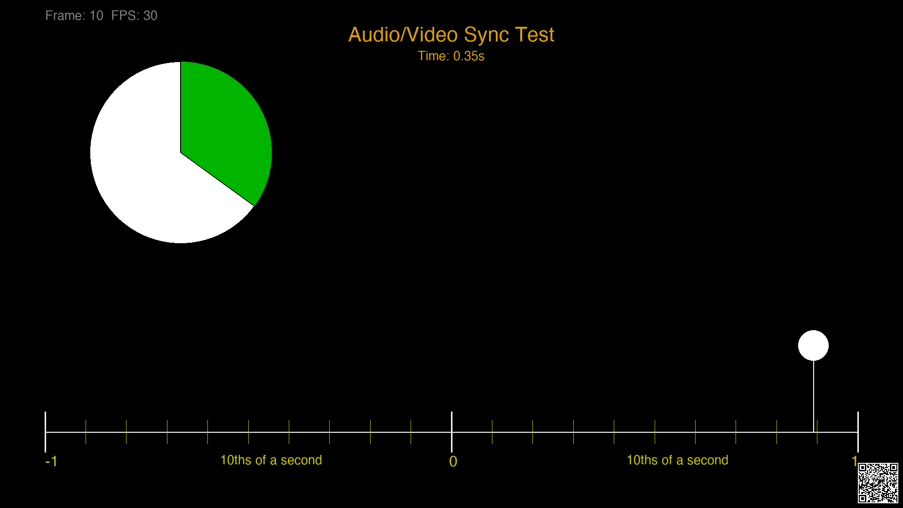
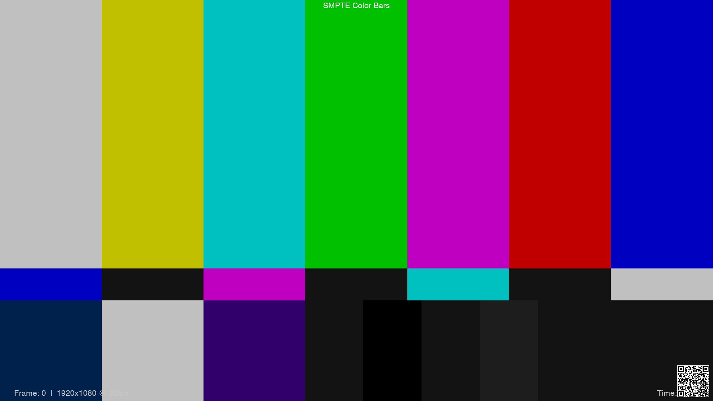
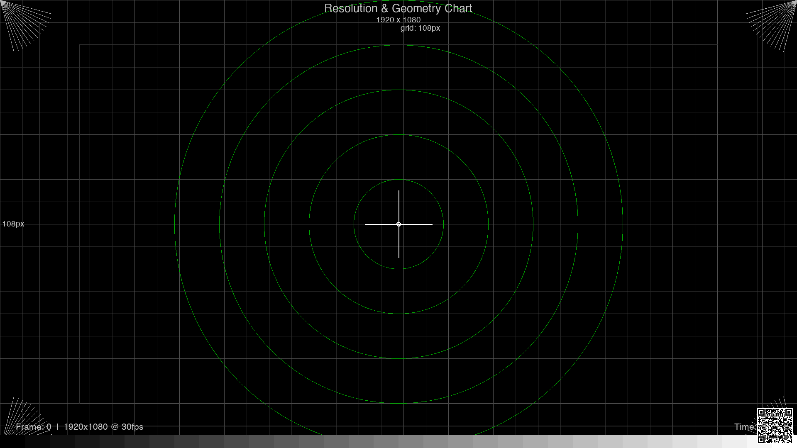
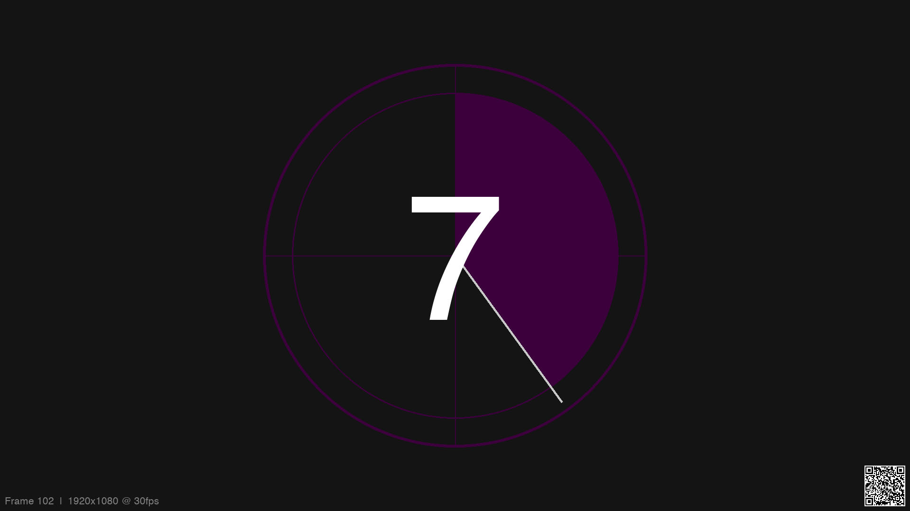

# Video Test Pattern Generator

A Python tool that generates video files with synchronized audio for testing video playback, encoding pipelines, and display calibration. Specify a test pattern, duration, frame rate, resolution, and codec — the tool renders the video frame-by-frame and encodes it via FFmpeg.

The framework is extensible: new patterns are added by subclassing `TestPattern` and registering them in the pattern registry.

## Requirements

- Python 3.9+
- FFmpeg (install via `brew install ffmpeg` on macOS)
- Python packages:

```bash
pip install -r requirements.txt
```

## Quick Start

```bash
# List all available patterns
python generate.py --list

# Generate a 10-second A/V sync test
python generate.py --pattern bouncing_ball --duration 10 --fps 30 --output sync_test.mp4
```

## Available Test Patterns

### Bouncing Ball A/V Sync (`bouncing_ball`)

A white ball sweeps back and forth across a horizontal timeline ruler marked in tenths of a second. A vertical reference line projects from the ball down to the ruler for precise timing reads. Each time the ball crosses the center mark, a short tone burst plays. A pie-chart clock in the upper left shows the fraction of the current second elapsed.

Use this to verify audio/video synchronization in your playback chain.



Example video: [`test/bouncing_ball.mp4`](test/bouncing_ball.mp4)

```bash
python generate.py --pattern bouncing_ball --duration 10 --fps 30 --output sync_test.mp4

# 4K at 60fps
python generate.py -p bouncing_ball -d 10 --fps 60 -r 3840x2160 -o sync_4k.mp4
```

---

### SMPTE Color Bars (`smpte_bars`)

Standard SMPTE RP 219 color bar pattern for color calibration and monitor alignment. The frame has three horizontal sections:

- **Top (67%):** Seven vertical bars — gray, yellow, cyan, green, magenta, red, blue at 75% intensity.
- **Middle (8%):** Reverse-order castellations for color decoder verification.
- **Bottom (25%):** PLUGE (Picture Line-Up Generation Equipment) region with sub-black and super-white patches for brightness/contrast setup.

Audio is a continuous 1 kHz reference tone at -20 dBFS.



Example video: [`test/smpte_bars.mp4`](test/smpte_bars.mp4)

```bash
python generate.py --pattern smpte_bars --duration 10 --output smpte.mp4

# ProRes for broadcast workflows
python generate.py -p smpte_bars -d 30 --codec prores -o smpte.mov
```

---

### Grid / Resolution Chart (`grid_chart`)

A static resolution and geometry test chart featuring:

- Fine and coarse grid lines for linearity and geometry checks.
- Five concentric circles to reveal aspect ratio or scaling distortion.
- Center crosshair for alignment verification.
- Corner resolution wedges (converging lines) to test sharpness at the edges.
- 80% and 90% safe-area outlines.
- 32-step grayscale ramp along the bottom for tonal response evaluation.

Audio is silent.



Example video: [`test/grid_chart.mp4`](test/grid_chart.mp4)

```bash
python generate.py --pattern grid_chart --duration 5 --output grid.mp4

# 4K resolution chart
python generate.py -p grid_chart -d 5 -r 3840x2160 -o grid_4k.mp4
```

---

### Countdown Leader (`countdown`)

Classic film-style countdown from 10 down to 0 with:

- Large countdown number in the center.
- A rotating sweep hand that completes one full revolution per second.
- Color-coded ring for each second.
- A beep tone at every whole second.
- Traditional "2-pop" — a white flash frame and louder/longer tone at the 2-mark for precise sync alignment.



Example video: [`test/countdown.mp4`](test/countdown.mp4)

```bash
python generate.py --pattern countdown --duration 11 --output countdown.mp4

# 60fps countdown
python generate.py -p countdown -d 11 --fps 60 -o countdown_60.mp4
```

## Embedded Timing Data

Every generated video includes three layers of machine-readable timing data, all enabled by default:

### SMPTE Timecode (container metadata)

Standard `HH:MM:SS:FF` timecode written into the MP4/MOV container. Readable by professional NLEs (Premiere, DaVinci Resolve, Avid), FFprobe, and most broadcast tools.

### QR Codes (visual, per-frame)

A small QR code in the bottom-right corner of each frame encodes a JSON payload:

```json
{"f":45,"t":1.5,"fps":30,"res":"1920x1080","pat":"Bouncing Ball A/V Sync"}
```

This is the most resilient timing method — it survives transcoding, re-encoding, screen capture, and even filming the display with a camera. Any single frame can be decoded independently.

### LTC Audio (Linear Timecode, right channel)

SMPTE timecode encoded as a biphase-modulated audio signal on the right audio channel (left channel carries the pattern audio). This is the broadcast standard for synchronizing devices that don't share a data bus — decodable by hardware LTC readers and software like `ltcdump`.

### Disabling features

```bash
# Disable QR codes (e.g. for clean calibration frames)
python generate.py -p smpte_bars --no-qr -o clean_bars.mp4

# Disable LTC (mono audio output)
python generate.py -p bouncing_ball --no-ltc -o mono_sync.mp4

# Disable all embedded data
python generate.py -p bouncing_ball --no-qr --no-timecode --no-ltc -o plain.mp4

# Move QR code to a different corner
python generate.py -p bouncing_ball --qr-position top-left -o sync.mp4
```

## Full CLI Reference

```
usage: generate.py [-h] [--list] [--pattern PATTERN] [--duration DURATION]
                   [--fps FPS] [--resolution WxH] [--codec {h264,h265,prores,utvideo}]
                   [--output OUTPUT] [--sample-rate SAMPLE_RATE] [--verbose]
                   [--no-qr] [--no-timecode] [--no-ltc]
                   [--qr-position {bottom-right,bottom-left,top-right,top-left}]

Options:
  --list, -l              List available test patterns
  --pattern, -p PATTERN   Test pattern name (default: bouncing_ball)
  --duration, -d SECS     Video duration in seconds (default: 10)
  --fps FPS               Frames per second (default: 30)
  --resolution, -r WxH    Video resolution (default: 1920x1080)
  --codec, -c CODEC       Video codec: h264, h265, prores, utvideo (default: h264)
  --output, -o FILE       Output file path (default: output.mp4)
  --sample-rate HZ        Audio sample rate (default: 48000)
  --verbose, -v           Print progress during rendering
  --no-qr                 Disable QR code overlay on each frame
  --no-timecode           Disable SMPTE timecode in container metadata
  --no-ltc                Disable LTC audio timecode on right channel
  --qr-position POS       QR code corner: bottom-right (default), bottom-left,
                          top-right, top-left
```

## Supported Codecs

| Codec     | Container | Use Case                              |
|-----------|-----------|---------------------------------------|
| `h264`    | .mp4      | Universal playback, web, streaming    |
| `h265`    | .mp4      | Higher compression, newer devices     |
| `prores`  | .mov      | Professional editing, broadcast       |
| `utvideo` | .avi/.mkv | Lossless intermediate, fast encode    |

## Adding a New Pattern

1. Create a new file in `patterns/`, e.g. `patterns/my_pattern.py`.
2. Subclass `TestPattern` and implement:
   - `metadata()` — return a `PatternMetadata` with name and description.
   - `generate_frame(t, frame_num)` — return a `PIL.Image` for the given time.
   - `generate_audio(duration, sample_rate)` — return a `numpy` float32 array of audio samples.
3. Register it at the bottom of your file:
   ```python
   from patterns import register_pattern
   register_pattern("my_pattern", MyPatternClass)
   ```
4. Import it in `patterns/__init__.py`:
   ```python
   from patterns import my_pattern
   ```

The new pattern will then appear in `--list` and be available via `--pattern my_pattern`.

## Project Structure

```
vid-timing-generator/
  generate.py            CLI entry point
  renderer.py            FFmpeg encoding pipeline
  audio.py               Tone burst, LTC, and audio utilities
  qr_overlay.py          QR code generation and compositing
  patterns/
    __init__.py           Base class and pattern registry
    bouncing_ball.py      A/V sync bouncing ball
    smpte_bars.py         SMPTE color bars
    grid_chart.py         Resolution/geometry chart
    countdown.py          Film-style countdown leader
  test/                   Pre-generated example videos
    bouncing_ball.mp4
    smpte_bars.mp4
    grid_chart.mp4
    countdown.mp4
  images/                 Sample frames for documentation
  requirements.txt        Python dependencies
```
